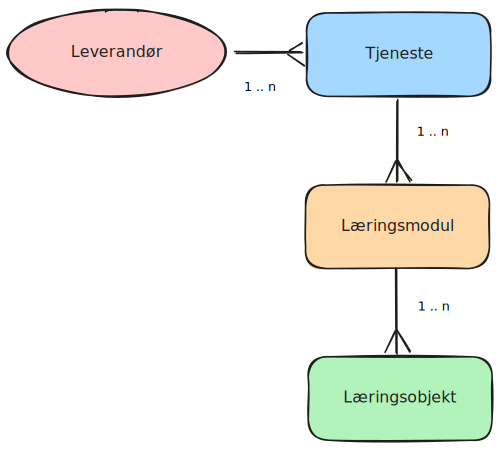

RFC: Overordnet informasjonsmodell for *Nasjonal Tjenestekatalog for Læremidler*
================================================================================
|Status         |                           |
|---------------|---------------------------|
| Forfattere:   | Kjartan Rekdal Müller, Brian Jørgensen, Eivind Andreassen|
| Oppdatert:    |                           |
| Frist:        |                           |
| Status:       | Utkast                    |

Bakgrunn
--------

En nasjonal tjenestekatalog for læremidler er under utvikling. En del av
arbeidet er å angi hva slags type objekter katalogen skal framvise. I
den forbindelse har vi utviklet en informasjonsmodell som vil tjene som
utgangspunkt for videre arbeid med databaser,
navigasjon/brukergrensesnitt og informasjonsarkitektur. Her ønsker vi
kommentarer knyttet til den delen av informasjonsmodellen som særlig
angår tjenesteleverandører.

Begreper
--------

-   **Informasjonsmodell**: "En informasjonsmodell er en konseptuell
    definisjon av informasjon som skal lagres eller utveksles.
    Informasjonsmodeller skiller seg fra datamodeller ved at
    informasjonsstrukturer kan beskrives uavhengig av
    enkeltapplikasjoner, implementasjonsteknologi eller hvordan dataene
    fysisk lagres eller aksesseres. Informasjonsmodeller kan beskrive
    betydning (\"semantikk\"), begrensninger, regler, relasjoner eller
    andre egenskaper."[^1]

-   **Læremiddel**: "Med læremiddel er her meint alle trykte,
    ikkje-trykte og digitale element som er utvikla til bruk i
    opplæringa, som skal brukast jamleg i opplæringa, og som dekkjer
    vesentlege delar av læreplanen i faget."[^2] 

-   **Læringsressurser**: "Digitale eller analoge læringsressurser er
    materiell med fagrelevant informasjon som blir integrert i
    læringsarbeidet på en didaktisk måte. Læringsressurser er ikke
    nødvendigvis primært utviklet med tanke på eller for bruk i skolen.
    Typiske eksempler er medieinnhold av typen bilder, tekst, spill,
    musikk, film og lyd."[^3]

-   **Læringsmodul**: En læringsmodul er en samling av læringsobjekter
    som er organisert etter en faglig eller tematisk avgrensning og med
    tanke på en spesifisert gruppe innen et gitt utdanningsnivå. Den
    skal ellers være innenfor det som beskrives som et *læremiddel*
    eller en *læringsressurs*. En læringsmodul vil typisk kunne
    representere et læremiddel, for eksempel *Matematikk 5. trinn*.

-   **Læringsobjekt**: Et læringsobjekt er en mindre, avgrenset del av
    en læringsmodul som i de fleste sammenhenger ikke vil være naturlig
    å dele opp videre -- selv om det i teorien kan det. Av og til brukes
    'smallest assignable unit', dvs minste enhet som er naturlig å
    spesifisere for bruk i læringsaktiviteter. Et læringsobjekt kan være
    sammensatt av mindre deler og er ikke det samme som det som i NS4180 
    omtales som læringsatom[^4]. På et nettsted kan det være
    en artikkel, i en lærebok kan det være et delkapittel.

-   **Tjeneste**: I dette dokumentet brukes *tjeneste* om digitale
    systemer satt opp til å formidle og presentere *læremidler* eller
    *læringsressurser* på nett eller som app beregnet på nettbrett eller
    mobil.

Problemstillinger
-----------------

Dette notatet adresserer spesielt tre problemstillinger:

1)  Hvilke typer objekter er det naturlig å presentere i en
    tjenestekatalog på kortere og lengre sikt?

2)  Hvordan henger de sammen?

3)  Risikoen for spamming av katalogen

Arbeidet med tjenestekatalogen bygger på en rekke tidligere arbeid og
aktiviteter, for eksempel:

-   Utredningen om "Nasjonal tjenestekatalog for digitale læremidler"

-   Den tilhørende piloten

-   Tidligere arbeid med å prøve ut søke-api for læremidler og
    læringsressurser

Et punkt som ofte er drøftet i det tidligere arbeidet er spørsmålet om
*granulering*:

> Granulering handler om å dele opp læremidlene i mindre bestanddeler,
> slik at hver enkelt del kan kobles mot kompetansemål, kjerneelementer
> og andre deler av læreplanverket.[^5]

Et analogt læremiddel kan for eksempel være delt opp i

-   Verk
-   Bok
-   Kapittel
-   Avsnitt / Oppgave

Digitale læremidler er ofte strukturert på en tilsvarende, men ikke
nødvendigvis lik måte. Strukturene vil også kunne være svært
forskjellige mellom ulike leverandører.

*Det første spørsmålet* gjelder da hvilke deler av slike strukturer bør
representeres som egne objekter. Utfordringen er at disse strukturene
vil variere. Hvordan formidler vi for eksempel i et søk hvor i
strukturen et treff er slik at det naturlig kan sammenlignes med andre
treff fra andre leverandører som kan være på andre nivåer?

*Det andre spørsmålet* dreier seg om sammenhengene mellom nivåene. Det ene
aspektet her er hvordan relasjon mellom objekter uttrykkes. Det andre er
i hvilken grad skal objekter på et gitt nivå aggregere informasjon fra
objektene under og arve informasjon fra nivåene over? Uten slike
mekanismer risikerer man at et treff på et gitt nivå har liten
informasjonsverdi fordi det mister relevant kontekst.

*Det tredje spørsmålet* er om det å tillate at et fleksibelt antall nivåer
representeres i katalogen vil øke risikoen for at katalogen spammes med
innhold. Dvs. at leverandører kan øke antall treff ved å legge inn
ekstra nivåer som strengt tatt ikke gir økt informasjonsverdi eller
annen merverdi under søk, og at mindre aktører fort blir mer usynlige i
mengden av treff fra større aktører med dypere strukturer.

Forslag
-------

For å delvis løse disse problemstillingene er vårt forslag ikke å
representere dype strukturer, men kun tillate tre nivåer av objekter:

1.   tjeneste,
2.   læringsmodul og
3.   læringsobjekt.

Disse kan representeres hierarkisk på denne måten: En leverandør kan
tilby en eller flere tjenester. En tjeneste kan brukes til å distribuere
en eller flere læringsmoduler. En læringsmodul kan inneholde en eller
flere læringsobjekter:

*De ulike nivåene og sammenhengene de i mellom.*

> [!IMPORTANT]
> I utgangspunktet er det **tjeneste** og **læringsmodul** vi vil vektlegge for
> å bygge opp katalogen, men vi beskriver hele modellen her for
> oversiktens skyld og med tanke på mulig fremtidig funksjonalitet.

### Forklaring på nivåene

**Tjeneste**: Tjenestekatalogen skal bli en *Nasjonal tjenestekatalog
for læremidler*. For å løse dette ser vi det nødvendig å skille mellom
tjeneste og læremiddel. En tjeneste er ikke i seg selv et læremiddel,
men det system som brukes for å distribuere læremidler/-middelet. Dette
kan være en nettside (typisk identifisert vha av et domene eller en
kombinasjon av domene og subdomene) eller en applikasjon for mobil eller
nettbrett. En tjeneste vil dekke ett eller flere fag, helst på flere
trinn. For eksempel kunne man beskrive hvilke læreplaner en tjeneste
dekker.

**Læringsmodul**: Dette er nivået som beskriver læremidlene. I den
analoge verden vil for eksempel en lærebok i matematikk for 5. trinn
være en læringsmodul. En læringsmodul vil være rettet mot et enkelt
eller et begrenset sett med trinn og være avgrenset til et fag,
tverrfaglig emne, tema, sett med kompetansemål eller lignende.

**Læringsobjekt**: Dette er det vanskeligste nivået å beskrive isolert.
I praksis vil dette være det laveste nivået tjenestene selv gir treff
på. Selv om det i teorien kan brytes opp i mindre bestanddeler, vil det
ikke være naturlig hverken med tanke på hvordan det kan brukes i
læringsaktiviteter eller organisering av informasjonshierarkier. Et
læringsobjekt vil som regel kunne knyttes til et kompetansemål og/eller
tema.

### Alternativ til mellomnivåer

Vår begrunnelse for å gå bort fra å representere større deler av en
struktur, er at i dypere strukturer representerer mellomnivåer hjelp til
navigasjon mer enn å være naturlige informasjonsenheter. Den
informasjonen som er knyttet til disse mellomnivåene, kan i stedet
knyttes til de nivåene som vi betegner som læringsmodul og
læringsobjekt.

La oss for eksempel anta en tjeneste som har inndelinger i `[fag ->
trinn -> tema -> artikkel]`. Hvis strukturen da er
`[Matematikk -> 5. trinn -> Brøk -> Brøk og tallinje]`,
så kan trinn-nivået 'arve' fag og utgjøre en læringsmodul, og
artikkel-nivået utgjøre et objekt ved å 'arve' brøk som tema. Hvis
artikkelen er knyttet til kompetansemål, så kan fagtilknytning og trinn
utledes, hvis ikke kan artikkelen også arve dette fra strukturen over.
Tilsvarende kan læringsmodulnivå aggregere tema og kompetansemål hvis
det ikke settes eksplisitt.

I katalogen vil denne strukturen da forenklet kunne representeres som
`[Matematikk for 5. trinn -> Brøk og tallinje]` uten
informasjonstap. Der man i den opprinnelige strukturen bruker fag og
tema som navigasjonspunkt, vil dette i stedet bli egenskaper man kan
filtrere på i tjenestekatalogen.

> [!IMPORTANT]
> Håndtering av tema blir derfor en viktig del av utviklingen av tjenestekatalogen i tillegg til undervisningsrelaterte egenskaper.

### Generell metadata på de ulike nivåene

For læringsmoduler og -objekter vil behovet stort sett dekkes av
NS4180. Der vil vi i utgangspunktet bruke de attributtene som er satt
som '*recommended*' i tillegg til at vi også anbefaler å bruke
*dateModified*.

For *organisasjon* vil vi forvente data både for *legalName*, *url* og
*logo*. Her vil vi i tillegg kreve at også attributtet *iso6523Code*
brukes[^6] for å kunne identifisere en
organisasjon i henhold til ISO 6523. Det vil i praksis si at
organisasjonsnummeret prefikses med et globalt lokasjonsnummer, f.eks.
9908:123456789, hvor 9908 betyr at nummeret er utstedt av
Brønnøysundregistrene.[^7]

For tjenester vil vi forvente at *provider* brukes for å angi
tjenesteleverandøren for tjenesten.

I de fleste sammenhenger vil leverandøren (provider) av tjenester være
den samme som utgiveren (publisher) av læremidlene som distribueres via
tjenesten, men i noen sammenhenger vil de være forskjellige. Dette
gjelder blant andre noen av de tjenestene som distribuerer digitale
lærebokutgaver fra flere forlag. Derfor vil vi anbefale at *provider*
også brukes på læringsmoduler og --objekter. For å angi relasjon til
tjeneste kan man bruke *isPartOf* med url til tjenesten.

### Læringsmetadata på de ulike nivåene

På alle tre nivåene er det relevant å knytte læring- og
undervisningsrelatert informasjon. Dette gjøres med å koble til
relevante begreper i Grep. For fag, som ikke er direkte kodet, vil vi
utarbeide en liste over termer som kan brukes. Dette er de koblingene vi
ser for oss på de ulike nivåene til å begynne med.

Tjeneste:
-   Hvilke læreplaner eller fag tjenesten dekker
-   Opplæringsnivå(er) eller årstrinn
-   Publikum (lærer, elev eller begge -- bruk lærer helst kun hvis
    pålogging med lærerrolle gir egen visning eller kreves for tilgang i
    det hele tatt )

Læringsmodul:
-   Fagkode / fag og årstrinn / læreplan og årstrinn / kompetansemålsett
    eller flere kompetansemål innen et sett / tverrfaglig emne og
    årstrinn / tema og årstrinn
-   Publikum
-   Tema
-   Tilgjengelighetsspesifikke egenskaper

Læringsobjekt:
-   Kompetansemål/Tverrfaglig emne/Tema
-   Publikum
-   Tema
-   Verb[^8]
-   Ressurstype
-   Tilgjengelighetsspesifikke egenskaper

> [!IMPORTANT] 
> Har man dypere strukturer enn det som tilsvarer modul og objekt, vil vi anbefale at man bruker *additionalType = LearningModule* for å angi læringsmoduler og *additionalType = LearningObject* for læringsobjekter. Det vil instruere hvordan objektene kan aggregere og arve egenskaper under registrering av objektene. Læringsmoduler vil kunne arve info som presiserer fag/tema og trinn, og kunne aggregere team/kompetansemål for å vise innhold. Læringsobjekter vil kunne arve tema fra mellomstrukturer og fag/tema+trinn fra læringsmodul hvis ikke kompetansemål er satt.

Dokumentendringer
-----------------

| Dato:       | Endring:        |
| ------------| --------------- |
| 2024-12-12  | Første utkast   |

Referanser
----------

[^1]: [Informasjonsmodell - openEHR Norway](https://openehr.atlassian.net/wiki/spaces/KLIM/pages/595427360/Informasjonsmodell)

[^2]: [Lov om
    grunnskoleopplæringa og den vidaregåande opplæringa
    (opplæringslova) - Kapittel 15 Opplæringsspråk, læremiddel og
    skolebibliotek -
    Lovdata](https://lovdata.no/dokument/NL/lov/2023-06-09-30/KAPITTEL_4-6#%C2%A715-3))

[^3]:  [Læremidler og læringsteknologi i skole og
    opplæring \|
    udir.no](https://www.udir.no/om-udir/tilskudd-og-prosjektmidler/tilskudd-til-laremidler/begrepsavklaring-skole/)

[^4]: [ NS4180 ](https://standard.no/fagomrader/laringsteknologi/norsk-standard-for-laringsteknologi/)

[^5]: [ Nasjonal tjenestekatalog for digitale læremidler - Utredning ](references/utredning.pdf)

[^6]: [iso6523Code - Schema.org
Property](https://schema.org/iso6523Code)

[^7]: [ DigDir: Virksomhetsidentifikator ](https://docs.digdir.no/resources/begrep/sikkerDigitalPost/begrep/virksomhetsidentifikator.html)

[^8]:  [ Liste over verb i Grep ](https://data.udir.no/kl06/v201906/verb-lk20)